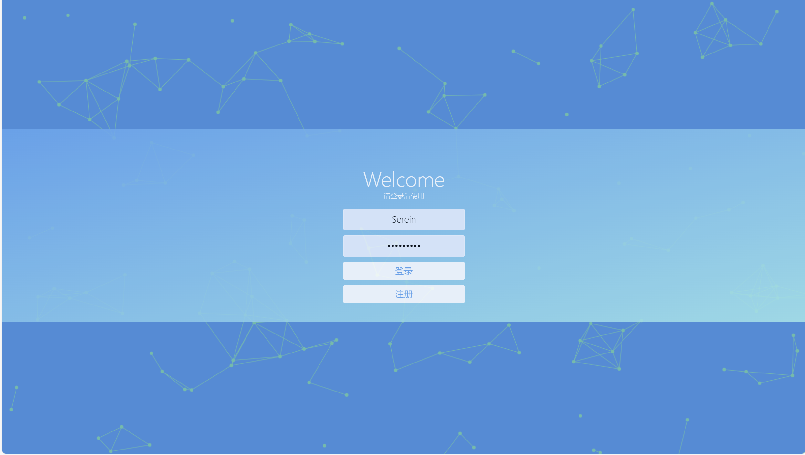

# SereinCR:一个简单的公共聊天室

a trival online chatroom based on python Flask
---

## structure

sereincr&emsp;**项目根目录**

&emsp;├─app&emsp;**主项目文件**

&emsp;│&emsp;&emsp;├─aiml&emsp;**机器人问答相关**

&emsp;│&emsp;&emsp;├─static&emsp;**静态文件，包括css,js**

&emsp;│&emsp;&emsp;├─templates&emsp;**html网页**

&emsp;│&emsp;&emsp;├─app.py&emsp;**主程序入口**

&emsp;│&emsp;&emsp;└─dbop.py&emsp;**数据库操作类**

&emsp;└─Sereincr.db&emsp;**数据库文件**

## usage

默认管理员账户：
Serein
Xyt314159

## tips

~~网页采用响应式架构，用移动设备访问或许会有不一样的效果~~

~~初学Flask写的proj，not very elegant~~

